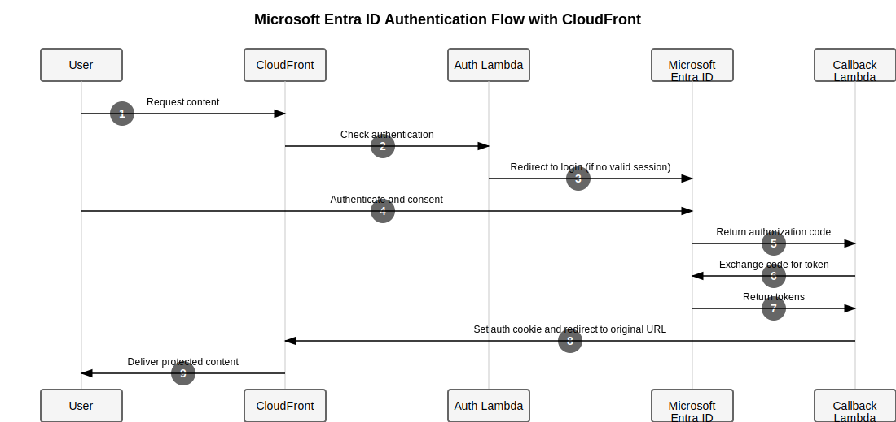

# Microsoft Entra ID SSO for CloudFront

A Terraform module to implement Microsoft Entra ID (Azure AD) authentication for CloudFront static websites using Lambda@Edge.

## Architecture



## How It Works

1. User requests protected content from CloudFront
2. Auth Lambda checks for valid session cookie
3. If no valid session, user is redirected to Microsoft login
4. User authenticates with Microsoft Entra ID
5. Microsoft returns authorization code to callback URL
6. Callback Lambda exchanges code for access and ID tokens
7. Microsoft returns tokens to Callback Lambda
8. Callback Lambda sets secure cookie and redirects to original URL
9. Authenticated user receives protected content

## Quick Start

### 1. Register Microsoft Entra ID Application

1. Create app registration in Microsoft Entra ID / Azure AD
2. Set redirect URL to `https://your-domain.com/callback`
3. Note the client ID, tenant ID, and create a client secret

### 2. Store Credentials

Create a secret in AWS Secrets Manager:

```json
{
  "tenant": "your-tenant-id",
  "client_id": "your-client-id",
  "client_secret": "your-client-secret",
  "redirect_uri": "https://your-domain.com/callback"
}
```

### 3. Deploy Module

```hcl
module "sso_auth" {
  source = "path/to/cloudfront-microsoft-sso"

  name_prefix    = "example"
  app_code       = "docs"
  lambda_runtime = "nodejs18.x"
  sso_config_arn = aws_secretsmanager_secret.sso_config.arn
}
```

### 4. Configure CloudFront

```hcl
resource "aws_cloudfront_distribution" "distribution" {
  # ... other configuration ...
  
  default_cache_behavior {
    # ... other settings ...
    
    lambda_function_association {
      event_type = "viewer-request"
      lambda_arn = module.sso_auth.authenticator_lambda_arn
      include_body = false
    }
  }
  
  ordered_cache_behavior {
    path_pattern = "/callback*"
    # ... other settings ...
    
    lambda_function_association {
      event_type = "viewer-request"
      lambda_arn = module.sso_auth.callback_lambda_arn
      include_body = false
    }
  }
}
```

## Module Inputs

| Name | Description | Type | Required |
|------|-------------|------|----------|
| name_prefix | Prefix for resource names | string | Yes |
| app_code | Application identifier | string | Yes |
| lambda_runtime | Node.js runtime | string | Yes |
| sso_config_arn | Secret ARN | string | Yes |

## Module Outputs

| Name | Description |
|------|-------------|
| authenticator_lambda_arn | Authenticator Lambda ARN |
| callback_lambda_arn | Callback Lambda ARN |

## Troubleshooting

- **403 Errors**: Check IAM permissions and Lambda execution role
- **Redirect Issues**: Verify redirect URI matches exactly across all configurations
- **Cookie Problems**: Ensure CloudFront distribution and cookie domain match

## Security Features

- HTTP-only secure cookies
- Credentials stored in AWS Secrets Manager
- Edge authentication with Lambda@Edge
- No client-side credential exposure