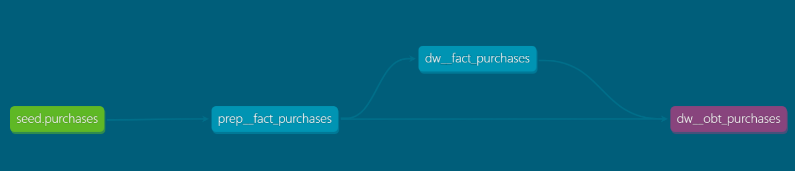

# Lambda Views Demo

This repository demonstrates a **Lambda Architecture** using dbt. It shows how you can combine historical and near real-time data through separate layers.



## What’s Included

- **Prep Layer:**  
  Loads and prepares all raw data from the `purchases` seed. This layer supports querying all data from the raw seed.

- **Fact Layer Macro:**  
  A macro (`fact_purchases_sql`) that transforms the prep data and applies a date filter using the `lambda_filter_by_date` macro.

- **Fact Layer Model:**  
  A model that calls the fact layer macro to build an incremental fact table from the prep data.

- **OBT/Lambda View:**  
  A view that uses `lambda_union_by_date` to dynamically union historical fact data with new raw data based on the batch cycle date. It determines whether to pull data from the fact or raw layer.

## Steps to Run the Demo

1. **Seed the Data:**  
   Run the following command to load the raw seed data:
   ```bash
   dbt seed
   ```

2. **Build the Models:**  
   Build all models by running:
   ```bash
   dbt run
   ```

3. **Initial Check:**  
   - Query the **fact** model and the **OBT/lambda view**.
   - You should see **20 records** in each.

4. **Simulate New Data:**  
   - Move the data from the backup seed into the raw seed file (this simulates new data arriving).
   - Run the seed command again:
     ```bash
     dbt seed
     ```

5. **Rebuild and Validate:**  
   Run:
   ```bash
   dbt run
   ```
   - Now, when you query the **fact** model, it should still show **20 records**.
   - The **OBT/lambda view** will display **45 records**, with **25 new records** coming from the raw layer.

This demo shows how the Lambda Architecture in dbt can dynamically merge historical data with new incoming data at query time.